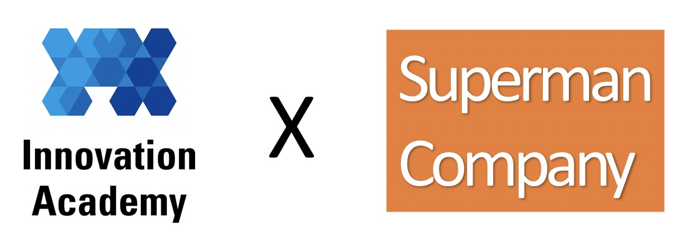

# CAPTCHA-2
```
이 음영으로 표시된 부분은 프로젝트 콘텐츠 작성에 도움을 주기 위한 설명이므로 나중에 삭제하거나 커멘트로 변경.
```
```
파일명 규칙 :
  ProjectTitle-N-Dvvv.lo.md : 프로젝트 내용 기술 파일.
  이 파일은 CAPTCHA-2-D007.ko.md로 소스는 markdown으로 작성되고 실제 배포할 때는. CAPTCHA-2-D007.ko.pdf 파일로 배포됨.
  'ProjectTitle-N'이 실제 사용되는 프로젝트명이므로 유일하게 정함.
  'N'은 프로젝트의 난이도를 기준으로 가장 낮은 난이도가 1임. 이 과제는. 2이므로 더 낮은 단계의 CAPTCHA-1이 있을 수 있다는 의미.
  'vvv'는 이 프로젝트의 정의 파일, 기술 파일, 평가 파일, 데이터 파일. 가운데 하나 이상 수정될 때. 커지는 개정판 버전 번호.
  'lo'는 locale 'ko', 'en', ...
```
```
문서 작성법과 예시 Link 안내 :
Project 정의, 역량 정의, 기술, 평가, 데이터 File 작성, 구성 가이드 문서 link
관련 파일 들에 대한 링크들 (이 프로젝트와 관련된 모든 파일들 정의가 있는 repo의 link)
ProjectTitle-N-fff-Pvvv.json : 프로젝트 정의 파일
ProjectTitle-N-Cnnn.json : 프로젝트 역량 정의 파일
ProjectTitle-N-Dvvv.lo.md : 프로젝트 내용 기술 파일 (이 파일의 소스)
ProjectTitle-N-Evvv.lo.md : 프로젝트 평가 가이드 파일
ProjectTitle-N-Tvvv.tar.gz : 프로젝트 구현을 위한 데이터 파일
```
```
아래에는 'Innovation Academy 로고 x 회사 로고' (회사는 이 콘텐츠를 같이 만든 회사)
```

<br>

</img> 

<br>

### Version 007 : Release Note
```
여기에는 한 문장의 간단한 버전 설명만 두고
각 버전의 full release-note는 이 문서 맨 뒤의 정식 release note 섹션에서 자세히 기록
```
* 처음 작성한 버전이지만, 001은 쫌 그래서 그냥 정한 버전 번호


### Authors
* Lee, Minsuk, mail@domain.com, Innovation Academy
* AI Superpower Lab, Superman Company
```
'이름, 이메일, 소속' 형식으로 저자/리뷰어들을 나열합니다.
   “성, 이름” 형식의 저자 이름 (기관일 때는 기관명)
   이메일 (email) : 위 저자/리뷰어의 이메일 주소
   소속 (affiliation) : 저자가 사람일 때 그 사람의 소속 기관
```

### Copyrights

</img>
이 문서는 크리에이티브 커먼즈 저작자표시 2.0 대한민국 라이선스에 따라
누구나 이용할 수 있습니다.
[CC-BY 2.0 (Creative Commons License Attribution), https://creativecommons.org/licenses/by/2.0/](https://creativecommons.org/licenses/by/2.0/):
이 문서를 공유하신다면 별도의 허가는 필요없고, 출처만 밝히면 됩니다.
문서를 수정하거나 변형하여 공유해도 됩니다.
```
이 문서는 프로젝트 콘텐츠 작성 예시를 보여주기 위한 문서로 공개를 전제로 CC-BY 저작권을 사용했습니다.
실제 만들어지는 프로젝트 콘텐츠의 저작권은 콘텐츠를 만든 주체가 결정하거나, 여러 주체가 개입된 경우 협의 하에 결정하는 것으로, 콘텐츠의 유출이나 그 유출에 의해 파생된 여러 결과가 교육생들의 학습 동기나 의지의 저하, 수행 결과 및 역량 평가의 불공정성을 야기할 수 있으며, 콘텐츠의 상업적 활용을 어렵게 만들 수 있습니다.
이 문서에는 가급적 저작권 요약만을 담고 전체 저작권 문서는 링크로 제공하기를 권장합니다.
```

## CAPTCHA
```
한 문단 정도의 프로젝트 개요
```

### 프로젝트 스토리
```
이 프로젝트가 왜 문제인지에 대한 story, 현장 이야기 (또는 주제에 따라서 SF 소설)
이 프로젝트는 어떤 문제를 해결하고 있으며,
그 문제가 해결되면 세상이 어떻게 바뀌는지,
이 문제가 해결되면 사용자가 얻게 되는 가치는 무엇인지
페르소나를 도입하여 비교적 기술적이지 않은 방식으로 스토리 텔링
```

### 프로젝트의 기술적 설명
```
문제의 기술적인 설명 (프로젝트의 결과를 정의하기 위한, requirement)
(위 스토리의 문제를 해결하기 위해, 이렇게 만들기로 했다.)
```

### 결과물에 관한 설명
```
만들어져야 하는 결과물에 이런 기능, 저런 기능이 있어야 하고,
입출력 및 중간 결과물 및 구성
입력은 뭔데 어떻게 받고,
출력은 뭔게 어떻게 보여주고, 
어떤 중간 결과가 있고,
그걸 만들기 위해 시스템이 최소한 이런 방식으로 구성되어야 하고
프로젝트 해결을 위한 제약 조건 (학습자에게 제공)
개발 환경 (언어, 플랫폼, 사용 프레임워크) 제시/제안/제한
(시스템의 구성별로, 제안과 제한을 할 수도 있고 알아서 하라 해도 되고)
- 어느 부분은 반드시 이런 프레임워크를 사용해야하고
- 어떤 부분에 이런 것을 사용해서는 안되고
- 시스템 구성 중 이 부분은 반드시 이렇게 해야하고
- 이렇게 구성하는 것이 일이 좀 쉬워질 것 같고
```

### 프로젝트를 구현할 때 제약 조건
```
(진짜 현장은 아니므로, 이 프로젝트의 과제 범위에서 시뮬레이션이 되는 제약 조건)
(또는 진짜 현장의 문제인 척하기 위한 환경 조건)
제약 조건의 예:
이런 입력/case는 실제로는 발생하기는 하지만 고려하지 않아도 되고
초당 n개의 입력에 대하여 각 결과가 x초 이내 화면에 나와야 하고
전체 메모리 사용량이 ~MB를 넘으면 안되고
입력 이미지의 해상도는 최소 이정도를 가정해야 하고
x개의 동시접속이 가능해야 하고 그때 최대 지연은 어때야 하고
...
```

### 프로젝트 결과의 검증
```
Test case 설계
평가 항목, 예시 데이터 (정량적/ox 평가 항목, 평가를 위한 예시데이터)
자동 프로그램에 의한 테스트를 하는 부분들과 평가 받는 방법 기술
	(구체적으로 평가를 절차 기술)
시각적인 결과로 확인하는 영역들
최종 화면, 데모 시연 방법, 시연 환경 만들기
또는 과제의 일부로 시연 환경 구성 방법을 제시
input과 output
예외처리 (error 상황의 동작) 정의평가 준비를 위한 안내
평가를 받을 것을 대비하여 어떤 것들을 준비해야하는지
프로젝트 데이타 파일 설명
데이터 파일 (tarball)에 들어있는 각 파일(폴더)에 대한 설명
 (코드, 테스트용 컨테이너 이미지, 디자인 리소스 등)
```

## 학습 지원 정보

### 이 프로젝트 수행을 위한 학습 리소스
```
아래 online forum에 'resource'에 있는 내용을 소개
```
* 이 과제를 수행하기 위한 학습 

### 프로젝트를 수행/리뷰/평가/멘토링을 위한 모든 정보 online Forum

아래 Forum, 사이트에서 이 프로젝트를 수행하는 다른 학생들과 만나서 학습 정보를 교환할 수 있으며, 평가, 멘토링, 코드리뷰를 받을 수 있습니다.
```
이 사이트들은 ProjectTitle-N이 결정되면 시스템이 자동으로 생성하는 영역.
학습 시스템에서 자동으로 링크들이 생성되어. 동료학습을 드라이브.
https://prj.innoaca.kr/forum/ProejectTitle/N/*** 에서
*** 에 따라 다음 링크들이 자동으로 생성됨 (실제로는 모든 링크가 독립적인 페이지로 만들어지지는 않을 수도 있고 태그를 통한 검색 시스템으로 운영될 수 있음)
o 학습 Resource 링크 (*** = resource)
  - 초기에 이 forum의 상단에는 콘텐츠를 만든 쪽에서 필요한 정보 (학습 자료, 동기부여를 위한 링크)들을 제공
  - 태그로 리소스 분류 관리
   . #동기부여 : 동기부여 용 스토리 동영상, 링크 등
   . #ONLINE : 동영상, 오픈소스 코드, 블로그, 서적 (어떤 책, 몇 장, 주제)
   . #TEXTBOOK : 이 프로젝트를 수행하면서 체화해야 할 지식 그 자체가 쓰여진 책 (정돈된 지식을 얻기 위한 리소스로서)
   . #USEUCASE : 이 프로젝트 관련 use case 동영상 (동기부여용)
  - 학습자들이 늘어나거나, 시장이 바뀜에 따라, 새로운 리소스 추가
  - 점차 학습자들에게 도움이 되는 정도/선호도에 따라 자동으로 노출 순위 조절
o 토론 및 Q&A 링크 (*** = forum)
 - 이 프로젝트에 대한 모든 사람의 thread 토론과 QA
o code review link (*** = codereview)
 - 작성한 코드에 대한 code review 사이트
o 동료 평가 링크 (*** = evaluation)
 - 동료 평가를 받기 위한 사이트
o 이 프로젝트에 대한 이전 멘토링/평가 토론 (*** = mentor)
 - 멘토링 결과, 평가 결과에 대한 관점을 논의
 - 이 토론을 기반으로 과제 내용/평가/환경/데이터 등을 수정
 - (이 내용의 일부는 멘토들에게만 보이게 됨)
o 이 프로젝트를 같은 하고 있는 (했던) 사람들 (*** = peer)
 - 여기 목록에 있는 동료, 선배와 소통하고 평가 요청, 협력 
```

## Release Note
```
각 버전별 수정 내용. 가장 최신 버전 부터, 최초 버전까지 역 연대순으로 자세히
```
* v007 :
  - CAPTCHA의 숫자 이미지를 인공지능을 해결하는 Machine Learning 프로젝트 콘텐츠 (예시)
  - 아래에 버전 history는 가상적으로 적은 것임 (이전 버전은 없음)
* v...
  - ...
* v002 :
  - 프로젝트 이미지 데이터 보강으로 프로젝트 완성도 기준 수치 조정 
* v001 :
  - CAPTCHA의 숫자 이미지를 인공지능으로 풀어내는 Machine Learning 프로젝트 콘텐츠 설계
  - 프로젝트 정의, 역량정의, 프로젝트 기술, 평가가이드, 데이터 파일 생성

