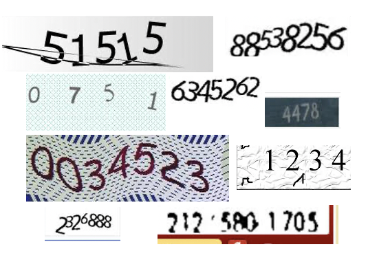

# CAPTCHA-2
```
이 음영으로 표시된 부분은 프로젝트 콘텐츠 작성에 도움을 주기 위한 설명이므로 나중에 삭제하거나 커멘트로 변경.
```
```
파일명 규칙 :
  ProjectTitle-N-Dvvv.lo.md : 프로젝트 내용 기술 파일.
  이 파일은 CAPTCHA-2-D007.ko.md로 소스는 markdown으로 작성되고 실제 배포할 때는. CAPTCHA-2-D007.ko.pdf 파일로 배포됨.
  'ProjectTitle-N'이 실제 사용되는 프로젝트명이므로 유일하게 정함.
  'N'은 프로젝트의 난이도를 기준으로 가장 낮은 난이도가 1임. 이 과제는. 2이므로 더 낮은 단계의 CAPTCHA-1이 있을 수 있다는 의미.
  'vvv'는 이 프로젝트의 정의 파일, 기술 파일, 평가 파일, 데이터 파일. 가운데 하나 이상 수정될 때. 커지는 개정판 버전 번호.
  'lo'는 locale 'ko', 'en', ...
```
```
문서 작성법과 예시 Link 안내 :
Project 정의, 역량 정의, 기술, 평가, 데이터 File 작성, 구성 가이드 문서 link
관련 파일 들에 대한 링크들 (이 프로젝트와 관련된 모든 파일들 정의가 있는 repo의 link)
ProjectTitle-N-fff-Pvvv.json : 프로젝트 정의 파일
ProjectTitle-N-Cnnn.json : 프로젝트 역량 정의 파일
ProjectTitle-N-Dvvv.lo.md : 프로젝트 내용 기술 파일 (이 파일의 소스)
ProjectTitle-N-Evvv.lo.md : 프로젝트 평가 가이드 파일
ProjectTitle-N-Tvvv.tar.gz : 프로젝트 구현을 위한 데이터 파일
```
```
아래에는 'Innovation Academy 로고 x 회사 로고' (회사는 이 콘텐츠를 같이 만든 회사)
```

<br>

</img> 

<br>

### Version 007 : Release Note
```
여기에는 한 문장의 간단한 버전 설명만 두고
각 버전의 full release-note는 이 문서 맨 뒤의 정식 release note 섹션에서 자세히 기록
```
* 처음 작성한 버전이지만, 예시로 001은 쫌 그래서 그냥 정한 버전 번호


### Authors
* Lee, Minsuk, mail@domain.com, Innovation Academy
* AI Superpower Lab, Superman Company
```
'이름, 이메일, 소속' 형식으로 저자/리뷰어들을 나열합니다.
   “성, 이름” 형식의 저자 이름 (기관일 때는 기관명)
   이메일 (email) : 위 저자/리뷰어의 이메일 주소
   소속 (affiliation) : 저자가 사람일 때 그 사람의 소속 기관
```

### Copyrights

</img>
이 문서는 크리에이티브 커먼즈 저작자표시 2.0 대한민국 라이선스에 따라
누구나 이용할 수 있습니다.
[CC-BY 2.0 (Creative Commons License Attribution), https://creativecommons.org/licenses/by/2.0/](https://creativecommons.org/licenses/by/2.0/):
이 문서를 공유하신다면 별도의 허가는 필요없고, 출처만 밝히면 됩니다.
문서를 수정하거나 변형하여 공유해도 됩니다.
```
이 문서에는 가급적 저작권 요약만을 담고 전체 저작권 문서는 링크를 제공하여 읽을 수 있도록 하기를 권장합니다.
```
```
이 문서는 프로젝트 콘텐츠 작성 예시를 보여주기 위한 문서로 공개를 전제로 CC-BY 저작권을 사용했습니다.
실제 만들어지는 프로젝트 콘텐츠의 저작권은
콘텐츠를 만든 주체가 결정하거나, 여러 주체가 개입된 경우 협의 하에 결정하게 됩니다.
CC와 같은 오픈소스 저작권이 바람직한 형태이나,
특정 교육 형태에서는 콘텐츠의 유출이나 그 유출에 의해 파생된 여러 결과가
교육생들의 학습 동기나 의지의 저하, 수행 결과 및 역량 평가의 불공정성을 야기할 수 있으며,
콘텐츠의 상업적 활용을 어렵게 만들 수 있습니다.
```

## CAPTCHA-2
```
한 문단 정도의 프로젝트 개요
```
CAPTCHA는 사람은 인식하지만, 컴퓨터는 이해할 수 없는 이미지를 제시하고 맞춤으로서 컴퓨터에 의한 자동 로그인을 막는 장치로 많이 사용되었다. 그러나, 인공지능/머신러닝 시대가 오지 않았는가? 다양한 CAPTCHA 이미지를 인식하여 정답을 맞추는 프로그램을 만들어보자.

### 프로젝트 스토리
```
이 프로젝트가 왜 문제인지에 대한 story, 현장 이야기 (또는 주제에 따라서 SF 소설)
이 프로젝트는 어떤 문제를 해결하고 있으며,
그 문제가 해결되면 세상이 어떻게 바뀌는지,
이 문제가 해결되면 사용자가 얻게 되는 가치는 무엇인지
페르소나를 도입하여 비교적 기술적이지 않은 방식으로 스토리텔링
```
CAPTCHA는 Completely Automated Public Turing test to tell Computers and Humans Apart의 약자로 사용자가 사람인지 컴퓨터인지를 구분하기 위한 방법이다. (CAPTure(d) + CHAracter, 에서 따왔다고도 한다.) CAPTCHA는 사람은 인식하지만, 컴퓨터는 이해할 수 없는 이미지를 제시하고 맞춤으로서 컴퓨터(봇)에 의한 자동 로그인을 막는 방법으로 많이 사용되고 있다. CAPTCHA는 광고성 게시물 방지, 아이디 자동생성 방지, 이메일 주소 보호, 온라인 선거, 계정 해킹 방지 등에 사용되며, 자동 프로그램으로 부당한 이득을 챙기거나 악용하는 사람들, 게시판의 불필요한 게시물 도배 등을 막을 수 있다. 

#### CAPTCHA의 한계 

이미 문자 기반의 CAPTCHA 중 일부는 연구자들에 의해 뚫리고 있으며, 수학 문제 CAPTCHA, 오디오 CAPTCHA 등 다른 CAPTCHA 방식들도 머신러닝 기술의 발전으로 점점 뚫리고 있다. 이를 보완하기 위한 다른 방법들 역시 개발되고 있는데, 문자 이미지가 아닌 거리, 사물 이미지 기반의 CAPTCHA는 특정 문화에 익숙해져 있지 않으면 맞히기 어려운 문제를 낼 수도 있어 잘 정의된 타켓 사용자만 통과할 수 있도록 설계할 수도 있다. 또 이미지나 수학 문제 풀기 등에 의존하지 않고, 마우스의 이동 패턴 등을 추적하여 진짜 사람인지를 판별하는 변형된 방식(reCAPTCHA, noCAPTCHA)도 사용한다.

#### reCAPTCHA (original)
(한글 wikipedia에서 전제) 오래 전에 제작된 종이 책들을 텍스트화하기 위해 OCR 프로그램을 사용하는데, 낙서나 얼룩, 헤짐 등의 방해요소만 있어도 OCR 프로그램은 텍스트를 제대로 인식하지 못한다. 이런 단어들은 사람이 하나하나 판독해야 하지만 수요가 적은 책들까지 일일이 입력하려면 노동력과 인건비가 많이 들어간다. 이를 해결하기 위해 CAPTCHA를 입력하는 수많은 사용자들의 힘을 빌리는 것이 바로 최초 버전의 reCAPTCHA이다. reCAPTCHA는 다음과 같은 과정을 거친다.

1. reCAPTCHA는 두 개의 암호코드를 제시한다. 하나는 컴퓨터가 이미 답을 알고 있는 단어이지만 다른 하나는 서적을 텍스트화하는 도중 OCR이 인식하지 못한 단어이다.
1. 사용자가 두 단어를 모두 입력하면 컴퓨터는 이미 답을 아는 단어로 대상이 사람인지를 확인한다.
1. 대상이 사람이라고 판정된 경우 나머지 단어 또한 정답으로 판단한다.
1. 이렇게 인식하지 못한 한 단어를 여러 번 반복해서 테스트한 뒤 높은 비율로 입력된 단어를 선택해 책을 텍스트화하는 데에 적용하게 된다.

#### CAPTCHA와 인공지능

CAPTCHA는 인공지능 기술의 한계에 기반을 두고 있다. 예를 들어 왜곡된 텍스트로부터 이미지를 해독해 내는 것은 여전히 쉽지 않다. 그러므로 CAPTCHA는 인공지능 사회에 명확한 과제를 제시한다. 보안을 위해 연구하는 사람들뿐만 아니라 악의적인 프로그래머들까지도 CAPTCHA를 뚫기 위해 인공지능 분야의 노력을 유도한다. CAPTCHA가 기계에 의해 풀리지 않으면 인간과 컴퓨터를 구분하는 방법이 있는 것이고 CAPTCHA가 풀리면 인공지능의 한계를 해결한 것이다.

#### 결국, 이 프로젝트가 해결하고자 하는 문제
```
이 부분은 반드시 기술
```
홍길동은 불법적인 방법을 동원한 부동산 투기로 엄청난 부를 축적한 변학도가 그 돈을 비트코인으로 다 환전하여 보관하고 있다는 것을 알았다. 또 변학도 측근을 매수하여 머리가 나쁜 변학도가 비트코인 지갑 주소를 근두운 클라우드에 평문 text 파일로 저장했다는 사실도 알게되었다. 그 클라우드의 로그인 ID는 변학도가 사용하는 이메일이고, 비밀번호는 다른 해킹 도구로 하나씩 테스트를 할 수 있는데, 근두운 클라우드 로그인 시스템은 이래 그림과 같은 숫자 이미지를 해독하는 CAPTCHA를 같이 로그인에 같이 사용하고 있었다.
홍길동은 CAPTCHA 해독 프로그램을 만들어 해당 시스템에 로그인 하여 비트코인 지갑 주소 파일을 얻고, 비트코인 지갑을 열어 환전한 뒤, 그 돈으로 아직 집이 없고 자녀가 있는 저소득 계층이 살 수 있는 집을 지어 거의 무상으로 임대를 하고자 한다.

<br>
</img> 
<br>

### 프로젝트의 기술적 설명
```
문제의 기술적인 설명 (프로젝트의 결과를 정의하기 위한, requirement)
(위 스토리의 문제를 해결하기 위해, 이런 단계적이 과정을 거치며, 이렇게 시험 환경을 만들어 해결하기로 했다.)
```
이 과제는 다음과 같은 단계로 진행된다. 

1. MNIST 데이터셋을 이용하여 하나의 숫자가 표시된 이미지에서 숫자를 인식하는 방법을 익힌다.
1. 위 프로그램을 확장하여 일련의 숫자를 인식하는 프로그램을 만든다.
1. 임의의 숫자 이미지 CAPTCHA를 이용하여 컴퓨터에 의한 자동 로그인을 걸러내는 근두운 클라우드의 가상적인 로그인 페이지를 만든다.
1. 위의 로그인 페이지에서 CAPTCHA 이미지를 찾아내서 이미지 내의 숫자를 자동으로 입력하여 로그인을 시도하는 프로그램을 만든다.

### 결과물에 관한 설명
```
이 프로젝트의 목표와 
만들어져야 하는 결과물에 이런 기능, 저런 기능이 있어야 하고,
입출력 및 중간 결과물 및 구성
입력은 뭔데 어떻게 받고,
출력은 뭔게 어떻게 보여주고, 
어떤 중간 결과가 있고,
그걸 만들기 위해 시스템이 최소한 이런 방식으로 구성되어야 하고
프로젝트 해결을 위한 제약 조건 (학습자에게 제공)
개발 환경 (언어, 플랫폼, 사용 프레임워크) 제시/제안/제한
(시스템의 구성별로, 제안과 제한을 할 수도 있고 알아서 하라 해도 되고)
- 어느 부분은 반드시 이런 프레임워크를 사용해야하고
- 어떤 부분에 이런 것을 사용해서는 안되고
- 시스템 구성 중 이 부분은 반드시 이렇게 해야하고
- 이렇게 구성하는 것이 일이 좀 쉬워질 것 같고
이 부분을 가장 길게 적혀야 하는 부분, 목표가 명확해야 프로젝트를 수행하며,
목표가 단계적으로 되어 있어야 지치지 않으며,
기본적인 목표를 능가하는 뭔가를 추가적으로 제시해야 도전을 함. 
```
1. MNIST 데이터셋을 이용하여 숫자를 인식하는 Tutorial을 참고하여 구현한 뒤, 문제를 해결하는 전 과정을 자세히 설명할 수 있는 수준의 이해를 하는 것
1. 위 기본 프로그램을 확장하여 여러 자리수의 숫자 이미지를 인식하여 출력하는 것. 주요 Test 데이터는 여러자리의 필기체, 여러 (종류,크기,간격)의 폰트를 여러 기울기로 섞어 출력한 4-8자리의 숫자 이미지. 이 숫자 이미지에 대한 인식률을 85% 이상으로 만들기
1. 가상적 로그인 페이지 만들기. ID(이메일), 비밀번호 (입력하면 * 표시) 입력 창이 

1. 보너스 과제 1
  - 위의 여러 자리수 인식의 예를 차량 번호판 인식으로 확장하여 차량 번호판 인식 프로그램을 작성하여, test set 데이터의 숫자 부분에 대하여 인식률 95% 이상을 달성하는 경우 보너스 포인트 부여
1. 보너스 과제 2
  - 위 보너스 과제에서 차량 번호판의 한글 부분까지를 95%이상의 정확도로 인식하는 경우 보너스 포인트 부여

### 프로젝트를 구현할 때 제약 조건
```
(진짜 현장은 아니므로, 이 프로젝트의 과제 범위에서 시뮬레이션이 되는 제약 조건)
(또는 진짜 현장의 문제인 척하기 위한 환경 조건)
제약 조건의 예:
이런 입력/case는 실제로는 발생하기는 하지만 고려하지 않아도 되고
초당 n개의 입력에 대하여 각 결과가 x초 이내 화면에 나와야 하고
전체 메모리 사용량이 ~MB를 넘으면 안되고
입력 이미지의 해상도는 최소 이정도를 가정해야 하고
x개의 동시접속이 가능해야 하고 그때 최대 지연은 어때야 하고
...
```
1. 실제 
### 프로젝트 결과의 검증
```
Test case 설계
평가 항목, 예시 데이터 (정량적/ox 평가 항목, 평가를 위한 예시데이터)
자동 프로그램에 의한 테스트를 하는 부분들과 평가 받는 방법 기술
	(구체적으로 평가를 절차 기술)
시각적인 결과로 확인하는 영역들
최종 화면, 데모 시연 방법, 시연 환경 만들기
또는 과제의 일부로 시연 환경 구성 방법을 제시
input과 output
예외처리 (error 상황의 동작) 정의평가 준비를 위한 안내
평가를 받을 것을 대비하여 어떤 것들을 준비해야하는지
프로젝트 데이타 파일 설명
데이터 파일 (tarball)에 들어있는 각 파일(폴더)에 대한 설명
 (코드, 테스트용 컨테이너 이미지, 디자인 리소스 등)
```

## 학습 지원 정보

### 이 프로젝트 수행을 위한 학습 리소스
```
콘텐츠 만드는 단계에서는 아래와 같이 학습 Resource 링크와 간단한 설명 (즉, 시스템 입력용)을 적어주세요.
이 내용은 아래 online forum에 'resource'로 옮겨지고, 학습 커뮤니티에 의해 개선되어 감.
```
* [CAPTCHA, Wikipedia](https://en.wikipedia.org/wiki/CAPTCHA) : CAPTCHA에 대한 일반적인 이해, [CAPTCHA, 한글 위키피디아](https://ko.wikipedia.org/wiki/CAPTCHA)
* [reCAPTCHA, Wikipedia](https://en.wikipedia.org/wiki/ReCAPTCHA) : reCATPCHA에 관한 이해
* [Turing Machine, Wikipedia](https://en.wikipedia.org/wiki/Turing_machine) : CAPTCHA가 추구하는 목표를 수학적으로 정의한 Turing Machine에 대한 소개, [튜링 기계, 한글 위키피디아](https://ko.wikipedia.org/wiki/튜링_기계)
* [Tensorflow Tutotials](https://www.tensorflow.org/tutorials?hl=ko) : Tensorflow를 초보부터 높은 단계에 이르기 까지 배울 수 있는 곳.
* [모두를 위한 딥러닝](https://www.inflearn.com/course/기본적인-머신러닝-딥러닝-강좌#) : 머신 러닝과 딥러닝에 대해 더 이해하고 본인들의 문제를 Tensorflow를 이용하여 풀 수 있게 도와주는 동영상 강의. 이 강좌는 수학이나 컴퓨터 공학적인 지식이 없어도 어렵지 않게 볼 수 있음.
* [MNIST Tutorial](https://tensorflowkorea.gitbooks.io/tensorflow-kr/content/g3doc/tutorials/mnist/beginners/) : 간단한 컴퓨터 비전 데이터셋인 MNIST를 이용하여 손으로 쓴 글자를 인식하는 과정을 설명
* [Tensorflow KR 페이스북 그룹](https://www.facebook.com/groups/TensorFlowKR) : tensorflow를 학습하거나, tensorflow, 다른 Machine Learning 도구에 관한 연구, 응용 제작을 하는 분들의 모임. 질의 응답이 매우 활발함
[Machine Learning Yearning](https://www.deeplearning.ai/machine-learning-yearning/) : 앤드유 응 교수의 ML 프로젝트를 진행할 때 고려해야 할 우선순위, 성능에 대한 고려 사항 (딥러닝 기술 자체를 다룬 책은 아니라 필독). PDF 버전을 인터넷에서 쉽게 구할 수 있음.
[AI Hub](http://www.aihub.or.kr/) : AI 학습용 데이터가 모여있는 곳

### 프로젝트를 수행/리뷰/평가/멘토링을 위한 모든 정보 online Forum

아래 Forum, 사이트에서 이 프로젝트를 수행하는 다른 학생들과 만나서 학습 정보를 교환할 수 있으며, 평가, 멘토링, 코드리뷰를 받을 수 있습니다.
```
이 사이트들은 ProjectTitle-N이 결정되면 시스템이 자동으로 생성하는 영역.
학습 시스템에서 자동으로 링크들이 생성되어. 동료학습을 드라이브.
https://prj.innoaca.kr/forum/ProejectTitle/N/*** 에서
*** 에 따라 다음 링크들이 자동으로 생성됨 
(실제로는 모든 링크가 독립적인 페이지로 만들어지는 않을 수도 있고 태그를 통한 검색시스템으로 운영됨)
o 학습 Resource 링크 (*** = resource)
  - 초기에 이 forum의 상단에는 콘텐츠를 만든 쪽에서 필요한 정보 (학습 자료, 동기부여를 위한 링크)들을 제공
  - 태그로 리소스 분류 관리
   . #동기부여 : 동기부여 용 스토리 동영상, 링크 등
   . #ONLINE : 동영상, 오픈소스 코드, 블로그, 서적 (어떤 책, 몇 장, 주제)
   . #TEXTBOOK : 이 프로젝트를 수행하면서 체화해야 할 지식 그 자체가 쓰여진 책 (정돈된 지식을 얻기 위한 리소스로서)
   . #USECASE : 이 프로젝트 관련 use case 동영상 (동기부여용)
  - 학습자들이 늘어나거나, 시장이 바뀜에 따라, 새로운 리소스 추가
  - 점차 학습자들에게 도움이 되는 정도/선호도에 따라 자동으로 노출 순위 조절
o 토론 및 Q&A 링크 (*** = forum)
 - 이 프로젝트에 대한 모든 사람의 thread 토론과 QA
o code review link (*** = codereview)
 - 작성한 코드에 대한 code review 사이트
o 동료 평가 링크 (*** = evaluation)
 - 동료 평가를 받기 위한 사이트
o 이 프로젝트에 대한 이전 멘토링/평가 토론 (*** = mentor)
 - 멘토링 결과, 평가 결과에 대한 관점을 논의
 - 이 토론을 기반으로 과제 내용/평가/환경/데이터 등을 수정
 - (이 내용의 일부는 멘토들에게만 보이게 됨)
o 이 프로젝트를 같은 하고 있는 (했던) 사람들 (*** = peer)
 - 여기 목록에 있는 동료, 선배와 소통하고 평가 요청, 협력 
```


## Release Note
```
각 버전별 수정 내용. 가장 최신 버전 부터, 최초 버전까지 역 연대순으로 자세히
```
* v007 :
  - CAPTCHA의 숫자 이미지를 인공지능을 해결하는 Machine Learning 프로젝트 콘텐츠 (예시)
  - 이 예시는 설명을 위해 내용의 많은 부분을 wikipedia에서 가져왔음 
  - 아래에 버전 history는 가상적으로 적은 것임 (이전 버전은 없음)
* v...
  - ...
* v002 :
  - 프로젝트 이미지 데이터 보강으로 프로젝트 완성도 기준 수치 조정 
* v001 :
  - CAPTCHA의 숫자 이미지를 인공지능으로 풀어내는 Machine Learning 프로젝트 콘텐츠 설계
  - 프로젝트 정의, 역량정의, 프로젝트 기술, 평가가이드, 데이터 파일 생성

